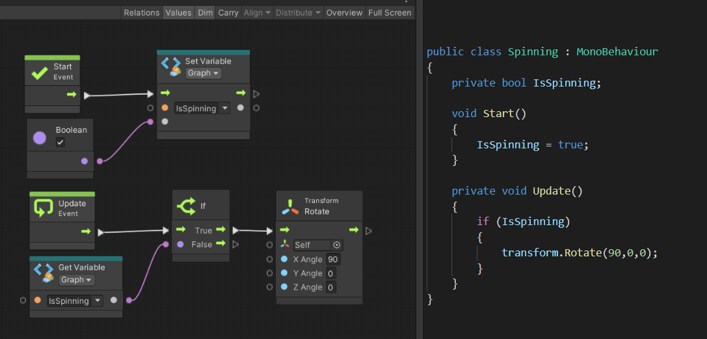

# Third portion of the tutorial

Start here to learn Visual Scripting, whether you are new to Unity or an experienced Unity programmer.

In this project, you will learn the windows and tools in Unity’s Visual Scripting user interface.

If you are new to programming, you will learn the basics of programming along the way. Everything you need to know before starting this project is in the Unity Essentials Pathway.

## Project Objective

In this project, you will:

- Learn fundamental programming concepts that you can apply in visual scripts.
- Get familiar with the Visual Scripting user interface in the Unity Editor.
- Create simple scripts that you can run.

By the end of this project, you'll be ready for [Clive the Cat's 'Visual Crypting'](https://learn.unity.com/project/visual-scripting-application-clive-the-cat-s-visual-crypting).

---

# About Unity Visual Scripting

- Define Graph and Script Machine
- Add a Script Machine component to a GameObject
- Save a Visual Scripting Graph as a project asset
- Open the Visual Scripting windows in the Unity Editor
- Explain and arrange the panels of the Script Graph window
- Pan, zoom, and return to center in the Script Graph window

If you’re new to programming, you’ll also learn about the Unity Scripting API, how scripts are used in Unity, and some basic programming concepts. (If you already know this, you’ll be prompted to skip ahead.)

## Materials

### Overview

This tutorial will introduce you to the Visual Scripting user interface. You will create a new Graph as a GameObject component, and begin exploring the Visual Scripting user interface. Whether you are new or experienced in Unity scripting, this tutorial will orient you to using the tool.

### Welcome to Visual Scripting

Here’s Ashley Alicea, Senior Developer Advocate, to introduce you to Unity Visual Scripting.

### Installing Visual Scripting

From Unity version 2021.1 onward, the Visual Scripting package is installed in Unity by default. Although you can manage it in the Package Manager if desired, no installation is required.

For versions 2019 LTS and 2020 LTS, Visual Scripting is available from the [Unity Asset Store as a product called Bolt](https://assetstore.unity.com/packages/tools/visual-scripting/bolt-163802).

For these tutorials, we recommend that you use Unity version 2021.1 or higher, using the installed Visual Scripting package. If you use Bolt, the user interface and the names of items will be slightly different than what is presented here, but you will be able to follow along.

### Before you begin

**New to Unity?**

If you have never scripted in Unity before, or if you are unfamiliar with Unity GameObjects and components, please consider starting with the Unity Essentials Pathway, which includes a project on the foundations of programming in Unity. Although that project uses C# scripting, it will introduce you to the Unity Editor and scripting fundamentals that will help you understand Visual Scripting more easily.

In this tutorial, we assume you understand GameObjects, components, the Inspector and Project windows, and how scripts are used in Unity.

### About Visual Scripting

#### What is Visual Scripting?

Unity’s Visual Scripting allows you to create the logic for your Unity projects without writing actual code. Whereas traditional scripting in Unity is done in the C# programming language, Visual Scripting is a visual “language” that lets you diagram your instructions. For example, these two scripts do the same thing — they are just written in two different languages.

#### Why make scripting visual?

Visual Scripting brings the power of Unity scripting to non-coders and future coders. For the visually-oriented, it makes it easier to learn and understand scripting concepts, and even watch your scripts run in real time. It empowers non-coders to extend or modify C# scripts, and it gives coders a way to better collaborate with artists and designers. Coders can also use Visual Scripting to create extensions, templates, and tools for other Unity users so that everyone can customize their Unity projects, whether or not they know C#.

#### What is the Unity Scripting API?

Visual Scripting also provides non-coders with access to the entire Unity Scripting API — the complete set of definitions of the classes, events, methods (behaviors), and properties (settings) you can manipulate in your Unity scripts. For example, the API includes the MonoBehaviours class, which has the Start and Update methods available to every GameObject. Although the API is big, you can do a lot in your scripts with just a few basics.

In Visual Scripting, you can look up any class, event, method, and property in the API through a series of menus, making it easier to find and discover what you need. The best way to learn more of the API is to look things up (in the Unity Scripting API reference and even within Visual Scripting) and experiment as you create your own scripts.

#### Interested in programming?

If programming in Unity is of particular interest to you, please try the Junior Programming Pathway if you haven’t already. You’ll get a solid foundation in programming in Unity — for which Visual Scripting can be another tool in your toolbox.

### What’s next?

Now that you know what Visual Scripting is and what it can do, let’s get started using Visual Scripting with simple GameObjects in the next tutorial.

---

# Configure your visual script with variables

Variables are essential programming tools. With them, you can store, calculate, and manipulate the input values to the units of your scripts.

In this tutorial, you’ll learn how to use Visual Scripting to create and manage several kinds of variables that have different scopes and uses. By the end of this tutorial, you’ll be able to:

- Create Graph, Object, and Scene variables and explain their uses
- Add Get Variable units to a Graph using the Blackboard
- Make variables available to be changed in the Inspector window
- Troubleshoot adjusting variable values in Scene and Game views
- Explain the Scene Variables object that appears in the Hierarchy of projects with Visual Scripts

### Overview

**Variables** are values that can, well, vary. Instead of coding inline values directly into your script as you did in the previous tutorial, you can represent them with names and manipulate their values in the script.

**Note to experienced C# scripters:** Visual Scripting gives you new and different ways to manage variables. Please follow this tutorial to learn how.

### Create a variable in the Blackboard

The Blackboard is the place to organize several types of variables. For this tutorial, we will only use variables that pertain to this Graph, your cube GameObject, and this Scene. However, variables can also apply to your entire project.
