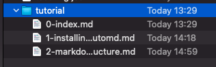

# Structure Guide and Formatting Rules

In order to generate a good-looking output, there are some rules to follow.

Here you will learn the recommendations for your text and file structure.

# Sidebar Rules

It is important to follow these rules when defining your tutorial:

- Each Markdown file (`.md`) represents an article, and an item on the left sidebar.
- The order of the articles are defined by their file names
- Each `.md` file is turned into a `.html` file.



# Article Rules

## Header image

An image is optional for each article. You may define it in 3 different ways:

- **By filename**: You may provide a `.png` image with the same name as the `.md` file (e.g.: `"01-article.md"` + `"01-article.png"`)
- **By markdown image tag**: You may use the markdown image tag to provide a custom image: ``
- **By using a special "search" tag on image**: You may automatically search for a unsplash.com image. See next section!

### Using unsplash.com to automatically search for a header image

You will need an account on unsplash.com, and a developer "Access Key" in order to use this feature.

1. Go to unsplash.com/developers and register as developer.
2. Use the `--unsplash-access-key YOUR_ACCESS_KEY_HERE` option with your access key.
3. Use a special image tag to search for an image: ``

Voila!

# Article summary and steps

As you've seen on [What to expect](1-what-to-expect.html), an article has a summary, and an unlimited amount of step sections.

The first title (`# h1`) is going to be the summary.

```markdown
# Title of the article

This content is going to be on the summary.
```

Following titles (`# h1`) are going to be formatted as steps.

```markdown
# Title of the article

This content is going to be on the summary.

# This is the first step

Contents of the first step

# This is the second step

Contents of the second step
```

# Generating the `.html` files from the command-line

Now, we're going to use the `tutomd` from the command-line in order to convert our `.md` files into `.html`.

```
tutomd ./path/to/markdown/* --out html
```

You should see an output that looks like this:

```
Copying from tutorial/3-directory-structure.png to /Users/endel/Projects/tutomd/html/3-directory-structure.png
Write /Users/endel/Projects/tutomd/html/index.html
Write /Users/endel/Projects/tutomd/html/1-what-to-expect.html
Write /Users/endel/Projects/tutomd/html/2-installing-tutomd.html
Write /Users/endel/Projects/tutomd/html/3-markdown-structure.html
Write /Users/endel/Projects/tutomd/html/theme.css
```

# Example

See the source-code of this tutorial [here](https://github.com/endel/tutomd/tree/master/tutorial).

# Extra: Icons

You may use a special tag to display icons in your content:

```html
<span class="icon add-cover"></span>
```

Available icons:

| Icon | Tag |
|---|---|
|<span class="icon add-cover"></span>|`<span class="icon add-cover"></span>`|
|<span class="icon add-user-icon"></span>|`<span class="icon add-user-icon"></span>`|
|<span class="icon android"></span>|`<span class="icon android"></span>`|
|<span class="icon appstore"></span>|`<span class="icon appstore"></span>`|
|<span class="icon archive-icon"></span>|`<span class="icon archive-icon"></span>`|
|<span class="icon arrow-down"></span>|`<span class="icon arrow-down"></span>`|
|<span class="icon assetstore-icon"></span>|`<span class="icon assetstore-icon"></span>`|
|<span class="icon attachment-icon"></span>|`<span class="icon attachment-icon"></span>`|
|<span class="icon audio-icon"></span>|`<span class="icon audio-icon"></span>`|
|<span class="icon back-icon"></span>|`<span class="icon back-icon"></span>`|
|<span class="icon bars"></span>|`<span class="icon bars"></span>`|
|<span class="icon baseline-mail-outline"></span>|`<span class="icon baseline-mail-outline"></span>`|
|<span class="icon baseline-public"></span>|`<span class="icon baseline-public"></span>`|
|<span class="icon baseline-store"></span>|`<span class="icon baseline-store"></span>`|
|<span class="icon baseline-translate"></span>|`<span class="icon baseline-translate"></span>`|
|<span class="icon bell"></span>|`<span class="icon bell"></span>`|
|<span class="icon beta-discount"></span>|`<span class="icon beta-discount"></span>`|
|<span class="icon beta-logo"></span>|`<span class="icon beta-logo"></span>`|
|<span class="icon bilibili"></span>|`<span class="icon bilibili"></span>`|
|<span class="icon bin"></span>|`<span class="icon bin"></span>`|
|<span class="icon blue_star"></span>|`<span class="icon blue_star"></span>`|
|<span class="icon bold"></span>|`<span class="icon bold"></span>`|
|<span class="icon browser-unsupported"></span>|`<span class="icon browser-unsupported"></span>`|
|<span class="icon call_made"></span>|`<span class="icon call_made"></span>`|
|<span class="icon camera-icon"></span>|`<span class="icon camera-icon"></span>`|
|<span class="icon chain-broken"></span>|`<span class="icon chain-broken"></span>`|
|<span class="icon chain"></span>|`<span class="icon chain"></span>`|
|<span class="icon chat"></span>|`<span class="icon chat"></span>`|
|<span class="icon check-mark"></span>|`<span class="icon check-mark"></span>`|
|<span class="icon check-square-o"></span>|`<span class="icon check-square-o"></span>`|
|<span class="icon check"></span>|`<span class="icon check"></span>`|
|<span class="icon clock"></span>|`<span class="icon clock"></span>`|
|<span class="icon content_copy"></span>|`<span class="icon content_copy"></span>`|
|<span class="icon curved-arrow"></span>|`<span class="icon curved-arrow"></span>`|
|<span class="icon dashboard"></span>|`<span class="icon dashboard"></span>`|
|<span class="icon document-code"></span>|`<span class="icon document-code"></span>`|
|<span class="icon dot"></span>|`<span class="icon dot"></span>`|
|<span class="icon download-icon"></span>|`<span class="icon download-icon"></span>`|
|<span class="icon download"></span>|`<span class="icon download"></span>`|
|<span class="icon email"></span>|`<span class="icon email"></span>`|
|<span class="icon end-call"></span>|`<span class="icon end-call"></span>`|
|<span class="icon expand-more"></span>|`<span class="icon expand-more"></span>`|
|<span class="icon external-link"></span>|`<span class="icon external-link"></span>`|
|<span class="icon eye-close"></span>|`<span class="icon eye-close"></span>`|
|<span class="icon eye-open"></span>|`<span class="icon eye-open"></span>`|
|<span class="icon facebook"></span>|`<span class="icon facebook"></span>`|
|<span class="icon fast"></span>|`<span class="icon fast"></span>`|
|<span class="icon file-all"></span>|`<span class="icon file-all"></span>`|
|<span class="icon file-empty"></span>|`<span class="icon file-empty"></span>`|
|<span class="icon file-excel"></span>|`<span class="icon file-excel"></span>`|
|<span class="icon file-image"></span>|`<span class="icon file-image"></span>`|
|<span class="icon file-pdf"></span>|`<span class="icon file-pdf"></span>`|
|<span class="icon file-picture"></span>|`<span class="icon file-picture"></span>`|
|<span class="icon file-ppt"></span>|`<span class="icon file-ppt"></span>`|
|<span class="icon file-text"></span>|`<span class="icon file-text"></span>`|
|<span class="icon file-video"></span>|`<span class="icon file-video"></span>`|
|<span class="icon file-word"></span>|`<span class="icon file-word"></span>`|
|<span class="icon file-zip"></span>|`<span class="icon file-zip"></span>`|
|<span class="icon filled-alarm"></span>|`<span class="icon filled-alarm"></span>`|
|<span class="icon filled-all_tickets"></span>|`<span class="icon filled-all_tickets"></span>`|
|<span class="icon filled-calendar"></span>|`<span class="icon filled-calendar"></span>`|
|<span class="icon filled-calendar2"></span>|`<span class="icon filled-calendar2"></span>`|
|<span class="icon filled-calendar3"></span>|`<span class="icon filled-calendar3"></span>`|
|<span class="icon filled-download"></span>|`<span class="icon filled-download"></span>`|
|<span class="icon filled-feed"></span>|`<span class="icon filled-feed"></span>`|
|<span class="icon filled-hang_up"></span>|`<span class="icon filled-hang_up"></span>`|
|<span class="icon filled-mic_off"></span>|`<span class="icon filled-mic_off"></span>`|
|<span class="icon filled-mic"></span>|`<span class="icon filled-mic"></span>`|
|<span class="icon filled-my_tickets"></span>|`<span class="icon filled-my_tickets"></span>`|
|<span class="icon filled-new_tickets"></span>|`<span class="icon filled-new_tickets"></span>`|
|<span class="icon filled-payment"></span>|`<span class="icon filled-payment"></span>`|
|<span class="icon filled-saved"></span>|`<span class="icon filled-saved"></span>`|
|<span class="icon filled-screenshot"></span>|`<span class="icon filled-screenshot"></span>`|
|<span class="icon filled-star_half"></span>|`<span class="icon filled-star_half"></span>`|
|<span class="icon filled-support"></span>|`<span class="icon filled-support"></span>`|
|<span class="icon filled-time"></span>|`<span class="icon filled-time"></span>`|
|<span class="icon filled-tips-ori_size"></span>|`<span class="icon filled-tips-ori_size"></span>`|
|<span class="icon filled-videocam_off"></span>|`<span class="icon filled-videocam_off"></span>`|
|<span class="icon filled-videocam"></span>|`<span class="icon filled-videocam"></span>`|
|<span class="icon filled-ws_tickets"></span>|`<span class="icon filled-ws_tickets"></span>`|
|<span class="icon follow-user"></span>|`<span class="icon follow-user"></span>`|
|<span class="icon followed-user"></span>|`<span class="icon followed-user"></span>`|
|<span class="icon followers-icon"></span>|`<span class="icon followers-icon"></span>`|
|<span class="icon gear"></span>|`<span class="icon gear"></span>`|
|<span class="icon gmail-icon"></span>|`<span class="icon gmail-icon"></span>`|
|<span class="icon hangup"></span>|`<span class="icon hangup"></span>`|
|<span class="icon headset"></span>|`<span class="icon headset"></span>`|
|<span class="icon help"></span>|`<span class="icon help"></span>`|
|<span class="icon history"></span>|`<span class="icon history"></span>`|
|<span class="icon hot"></span>|`<span class="icon hot"></span>`|
|<span class="icon hotmail-icon"></span>|`<span class="icon hotmail-icon"></span>`|
|<span class="icon i18n"></span>|`<span class="icon i18n"></span>`|
|<span class="icon ic_camera"></span>|`<span class="icon ic_camera"></span>`|
|<span class="icon ic_close"></span>|`<span class="icon ic_close"></span>`|
|<span class="icon ic_expand"></span>|`<span class="icon ic_expand"></span>`|
|<span class="icon ic_more"></span>|`<span class="icon ic_more"></span>`|
|<span class="icon ic_pause"></span>|`<span class="icon ic_pause"></span>`|
|<span class="icon ic_play"></span>|`<span class="icon ic_play"></span>`|
|<span class="icon ic_record"></span>|`<span class="icon ic_record"></span>`|
|<span class="icon ic_share"></span>|`<span class="icon ic_share"></span>`|
|<span class="icon ic_stop"></span>|`<span class="icon ic_stop"></span>`|
|<span class="icon ic_volume_mute"></span>|`<span class="icon ic_volume_mute"></span>`|
|<span class="icon ic_volume_on"></span>|`<span class="icon ic_volume_on"></span>`|
|<span class="icon icon_warning"></span>|`<span class="icon icon_warning"></span>`|
|<span class="icon icon-add-member"></span>|`<span class="icon icon-add-member"></span>`|
|<span class="icon icon-admin"></span>|`<span class="icon icon-admin"></span>`|
|<span class="icon icon-applestore"></span>|`<span class="icon icon-applestore"></span>`|
|<span class="icon icon-arrow-down"></span>|`<span class="icon icon-arrow-down"></span>`|
|<span class="icon icon-arrow-left-bold"></span>|`<span class="icon icon-arrow-left-bold"></span>`|
|<span class="icon icon-arrow-left"></span>|`<span class="icon icon-arrow-left"></span>`|
|<span class="icon icon-arrow-right-bold"></span>|`<span class="icon icon-arrow-right-bold"></span>`|
|<span class="icon icon-arrow-right"></span>|`<span class="icon icon-arrow-right"></span>`|
|<span class="icon icon-arrow-up"></span>|`<span class="icon icon-arrow-up"></span>`|
|<span class="icon icon-arrows-down"></span>|`<span class="icon icon-arrows-down"></span>`|
|<span class="icon icon-bad"></span>|`<span class="icon icon-bad"></span>`|
|<span class="icon icon-bold"></span>|`<span class="icon icon-bold"></span>`|
|<span class="icon icon-bookmark"></span>|`<span class="icon icon-bookmark"></span>`|
|<span class="icon icon-bookmarked"></span>|`<span class="icon icon-bookmarked"></span>`|
|<span class="icon icon-category"></span>|`<span class="icon icon-category"></span>`|
|<span class="icon icon-certificate"></span>|`<span class="icon icon-certificate"></span>`|
|<span class="icon icon-clear"></span>|`<span class="icon icon-clear"></span>`|
|<span class="icon icon-close"></span>|`<span class="icon icon-close"></span>`|
|<span class="icon icon-close2"></span>|`<span class="icon icon-close2"></span>`|
|<span class="icon icon-comments"></span>|`<span class="icon icon-comments"></span>`|
|<span class="icon icon-complete"></span>|`<span class="icon icon-complete"></span>`|
|<span class="icon icon-connect"></span>|`<span class="icon icon-connect"></span>`|
|<span class="icon icon-contributor"></span>|`<span class="icon icon-contributor"></span>`|
|<span class="icon icon-delete"></span>|`<span class="icon icon-delete"></span>`|
|<span class="icon icon-dismiss"></span>|`<span class="icon icon-dismiss"></span>`|
|<span class="icon icon-downgrade"></span>|`<span class="icon icon-downgrade"></span>`|
|<span class="icon icon-edit"></span>|`<span class="icon icon-edit"></span>`|
|<span class="icon icon-email"></span>|`<span class="icon icon-email"></span>`|
|<span class="icon icon-employees"></span>|`<span class="icon icon-employees"></span>`|
|<span class="icon icon-event"></span>|`<span class="icon icon-event"></span>`|
|<span class="icon icon-good"></span>|`<span class="icon icon-good"></span>`|
|<span class="icon icon-group"></span>|`<span class="icon icon-group"></span>`|
|<span class="icon icon-heart-o"></span>|`<span class="icon icon-heart-o"></span>`|
|<span class="icon icon-heart"></span>|`<span class="icon icon-heart"></span>`|
|<span class="icon icon-info"></span>|`<span class="icon icon-info"></span>`|
|<span class="icon icon-jobs"></span>|`<span class="icon icon-jobs"></span>`|
|<span class="icon icon-like"></span>|`<span class="icon icon-like"></span>`|
|<span class="icon icon-link"></span>|`<span class="icon icon-link"></span>`|
|<span class="icon icon-location"></span>|`<span class="icon icon-location"></span>`|
|<span class="icon icon-location2"></span>|`<span class="icon icon-location2"></span>`|
|<span class="icon icon-manufacturing"></span>|`<span class="icon icon-manufacturing"></span>`|
|<span class="icon icon-mark-all-read"></span>|`<span class="icon icon-mark-all-read"></span>`|
|<span class="icon icon-member-copy"></span>|`<span class="icon icon-member-copy"></span>`|
|<span class="icon icon-menu"></span>|`<span class="icon icon-menu"></span>`|
|<span class="icon icon-more-horiz"></span>|`<span class="icon icon-more-horiz"></span>`|
|<span class="icon icon-more-jobs"></span>|`<span class="icon icon-more-jobs"></span>`|
|<span class="icon icon-my-tickets"></span>|`<span class="icon icon-my-tickets"></span>`|
|<span class="icon icon-new-tickets"></span>|`<span class="icon icon-new-tickets"></span>`|
|<span class="icon icon-ordered-list-item"></span>|`<span class="icon icon-ordered-list-item"></span>`|
|<span class="icon icon-pending"></span>|`<span class="icon icon-pending"></span>`|
|<span class="icon icon-plus"></span>|`<span class="icon icon-plus"></span>`|
|<span class="icon icon-receipt"></span>|`<span class="icon icon-receipt"></span>`|
|<span class="icon icon-reject"></span>|`<span class="icon icon-reject"></span>`|
|<span class="icon icon-report"></span>|`<span class="icon icon-report"></span>`|
|<span class="icon icon-rocket"></span>|`<span class="icon icon-rocket"></span>`|
|<span class="icon icon-schedule"></span>|`<span class="icon icon-schedule"></span>`|
|<span class="icon icon-settings-border"></span>|`<span class="icon icon-settings-border"></span>`|
|<span class="icon icon-settings"></span>|`<span class="icon icon-settings"></span>`|
|<span class="icon icon-specialty-animation"></span>|`<span class="icon icon-specialty-animation"></span>`|
|<span class="icon icon-specialty-art"></span>|`<span class="icon icon-specialty-art"></span>`|
|<span class="icon icon-specialty-audio"></span>|`<span class="icon icon-specialty-audio"></span>`|
|<span class="icon icon-specialty-develop"></span>|`<span class="icon icon-specialty-develop"></span>`|
|<span class="icon icon-specialty-localization"></span>|`<span class="icon icon-specialty-localization"></span>`|
|<span class="icon icon-specialty-marketing"></span>|`<span class="icon icon-specialty-marketing"></span>`|
|<span class="icon icon-specialty-other"></span>|`<span class="icon icon-specialty-other"></span>`|
|<span class="icon icon-specialty-production"></span>|`<span class="icon icon-specialty-production"></span>`|
|<span class="icon icon-specialty-testing"></span>|`<span class="icon icon-specialty-testing"></span>`|
|<span class="icon icon-specialty-vr"></span>|`<span class="icon icon-specialty-vr"></span>`|
|<span class="icon icon-specialty-writing"></span>|`<span class="icon icon-specialty-writing"></span>`|
|<span class="icon icon-steam"></span>|`<span class="icon icon-steam"></span>`|
|<span class="icon icon-support"></span>|`<span class="icon icon-support"></span>`|
|<span class="icon icon-team-add-member"></span>|`<span class="icon icon-team-add-member"></span>`|
|<span class="icon icon-tel"></span>|`<span class="icon icon-tel"></span>`|
|<span class="icon icon-triangle-down"></span>|`<span class="icon icon-triangle-down"></span>`|
|<span class="icon icon-triangle-right"></span>|`<span class="icon icon-triangle-right"></span>`|
|<span class="icon icon-triangle-up"></span>|`<span class="icon icon-triangle-up"></span>`|
|<span class="icon icon-triangle-updown"></span>|`<span class="icon icon-triangle-updown"></span>`|
|<span class="icon icon-unordered-list-item"></span>|`<span class="icon icon-unordered-list-item"></span>`|
|<span class="icon icon-upgrade"></span>|`<span class="icon icon-upgrade"></span>`|
|<span class="icon icon-upload-image"></span>|`<span class="icon icon-upload-image"></span>`|
|<span class="icon icon-user"></span>|`<span class="icon icon-user"></span>`|
|<span class="icon icons_active_message"></span>|`<span class="icon icons_active_message"></span>`|
|<span class="icon icons_alignment_center"></span>|`<span class="icon icons_alignment_center"></span>`|
|<span class="icon icons_alignment_fullscreen"></span>|`<span class="icon icons_alignment_fullscreen"></span>`|
|<span class="icon icons_alignment_left"></span>|`<span class="icon icons_alignment_left"></span>`|
|<span class="icon icons_alignment_normal"></span>|`<span class="icon icons_alignment_normal"></span>`|
|<span class="icon icons_alignment_right"></span>|`<span class="icon icons_alignment_right"></span>`|
|<span class="icon icons_arrow_down"></span>|`<span class="icon icons_arrow_down"></span>`|
|<span class="icon icons_arrow_right"></span>|`<span class="icon icons_arrow_right"></span>`|
|<span class="icon icons_attachment2"></span>|`<span class="icon icons_attachment2"></span>`|
|<span class="icon icons_back_home"></span>|`<span class="icon icons_back_home"></span>`|
|<span class="icon icons_back"></span>|`<span class="icon icons_back"></span>`|
|<span class="icon icons_blank"></span>|`<span class="icon icons_blank"></span>`|
|<span class="icon icons_block_h1"></span>|`<span class="icon icons_block_h1"></span>`|
|<span class="icon icons_block_h2"></span>|`<span class="icon icons_block_h2"></span>`|
|<span class="icon icons_block_ol"></span>|`<span class="icon icons_block_ol"></span>`|
|<span class="icon icons_block_quote"></span>|`<span class="icon icons_block_quote"></span>`|
|<span class="icon icons_block_ul"></span>|`<span class="icon icons_block_ul"></span>`|
|<span class="icon icons_calendar"></span>|`<span class="icon icons_calendar"></span>`|
|<span class="icon icons_close"></span>|`<span class="icon icons_close"></span>`|
|<span class="icon icons_code"></span>|`<span class="icon icons_code"></span>`|
|<span class="icon icons_complete-85"></span>|`<span class="icon icons_complete-85"></span>`|
|<span class="icon icons_complete"></span>|`<span class="icon icons_complete"></span>`|
|<span class="icon icons_contract"></span>|`<span class="icon icons_contract"></span>`|
|<span class="icon icons_download_cloud"></span>|`<span class="icon icons_download_cloud"></span>`|
|<span class="icon icons_download"></span>|`<span class="icon icons_download"></span>`|
|<span class="icon icons_embed"></span>|`<span class="icon icons_embed"></span>`|
|<span class="icon icons_expand"></span>|`<span class="icon icons_expand"></span>`|
|<span class="iconicons_hangt up_filled"></span>|`<span class="iconicons_hangt up_filled"></span>`|
|<span class="iconicons_hangt up_outlined"></span>|`<span class="iconicons_hangt up_outlined"></span>`|
|<span class="icon icons_inline_bold"></span>|`<span class="icon icons_inline_bold"></span>`|
|<span class="icon icons_inline_clear"></span>|`<span class="icon icons_inline_clear"></span>`|
|<span class="icon icons_inline_italic"></span>|`<span class="icon icons_inline_italic"></span>`|
|<span class="icon icons_inline_link"></span>|`<span class="icon icons_inline_link"></span>`|
|<span class="icon icons_inline_underline"></span>|`<span class="icon icons_inline_underline"></span>`|
|<span class="icon icons_jump_to_top"></span>|`<span class="icon icons_jump_to_top"></span>`|
|<span class="icon icons_link"></span>|`<span class="icon icons_link"></span>`|
|<span class="icon icons_live_on"></span>|`<span class="icon icons_live_on"></span>`|
|<span class="icon icons_live"></span>|`<span class="icon icons_live"></span>`|
|<span class="icon icons_lockoff"></span>|`<span class="icon icons_lockoff"></span>`|
|<span class="icon icons_lockon"></span>|`<span class="icon icons_lockon"></span>`|
|<span class="icon icons_logout"></span>|`<span class="icon icons_logout"></span>`|
|<span class="icon icons_loudspeaker_step1"></span>|`<span class="icon icons_loudspeaker_step1"></span>`|
|<span class="icon icons_loudspeaker_step2"></span>|`<span class="icon icons_loudspeaker_step2"></span>`|
|<span class="icon icons_loudspeaker_step3"></span>|`<span class="icon icons_loudspeaker_step3"></span>`|
|<span class="icon icons_message_requests"></span>|`<span class="icon icons_message_requests"></span>`|
|<span class="icon icons_message"></span>|`<span class="icon icons_message"></span>`|
|<span class="icon icons_mic_off_filled"></span>|`<span class="icon icons_mic_off_filled"></span>`|
|<span class="icon icons_mic_off_outlined"></span>|`<span class="icon icons_mic_off_outlined"></span>`|
|<span class="icon icons_mute"></span>|`<span class="icon icons_mute"></span>`|
|<span class="icon icons_paragraph"></span>|`<span class="icon icons_paragraph"></span>`|
|<span class="icon icons_pause"></span>|`<span class="icon icons_pause"></span>`|
|<span class="icon icons_photo"></span>|`<span class="icon icons_photo"></span>`|
|<span class="icon icons_play"></span>|`<span class="icon icons_play"></span>`|
|<span class="icon icons_refresh"></span>|`<span class="icon icons_refresh"></span>`|
|<span class="icon icons_reminder_filled"></span>|`<span class="icon icons_reminder_filled"></span>`|
|<span class="icon icons_reminder_outlined"></span>|`<span class="icon icons_reminder_outlined"></span>`|
|<span class="icon icons_repost"></span>|`<span class="icon icons_repost"></span>`|
|<span class="icon icons_slash"></span>|`<span class="icon icons_slash"></span>`|
|<span class="icon icons_socialicon-facebook"></span>|`<span class="icon icons_socialicon-facebook"></span>`|
|<span class="icon icons_socialicon-pinterest"></span>|`<span class="icon icons_socialicon-pinterest"></span>`|
|<span class="icon icons_socialicon-twitter"></span>|`<span class="icon icons_socialicon-twitter"></span>`|
|<span class="icon icons_sound"></span>|`<span class="icon icons_sound"></span>`|
|<span class="icon icons_time"></span>|`<span class="icon icons_time"></span>`|
|<span class="icon icons_trash"></span>|`<span class="icon icons_trash"></span>`|
|<span class="icon icons_trophy"></span>|`<span class="icon icons_trophy"></span>`|
|<span class="icon icons_udp_back"></span>|`<span class="icon icons_udp_back"></span>`|
|<span class="icon icons_udp_error"></span>|`<span class="icon icons_udp_error"></span>`|
|<span class="icon icons_udp_eye_close"></span>|`<span class="icon icons_udp_eye_close"></span>`|
|<span class="icon icons_udp_eye_open"></span>|`<span class="icon icons_udp_eye_open"></span>`|
|<span class="icon icons_udp_lightning"></span>|`<span class="icon icons_udp_lightning"></span>`|
|<span class="icon icons_udp_pack"></span>|`<span class="icon icons_udp_pack"></span>`|
|<span class="icon icons_udp_promote"></span>|`<span class="icon icons_udp_promote"></span>`|
|<span class="icon icons_udp_purchase"></span>|`<span class="icon icons_udp_purchase"></span>`|
|<span class="icon icons_udp_sync"></span>|`<span class="icon icons_udp_sync"></span>`|
|<span class="icon icons_udp_upload"></span>|`<span class="icon icons_udp_upload"></span>`|
|<span class="icon icons_unread_threads"></span>|`<span class="icon icons_unread_threads"></span>`|
|<span class="icon icons_voice"></span>|`<span class="icon icons_voice"></span>`|
|<span class="icon icons_warning_info"></span>|`<span class="icon icons_warning_info"></span>`|
|<span class="icon icons_warning"></span>|`<span class="icon icons_warning"></span>`|
|<span class="icon icons-about"></span>|`<span class="icon icons-about"></span>`|
|<span class="icon icons-add-member"></span>|`<span class="icon icons-add-member"></span>`|
|<span class="icon icons-add"></span>|`<span class="icon icons-add"></span>`|
|<span class="icon icons-anonymous"></span>|`<span class="icon icons-anonymous"></span>`|
|<span class="icon icons-app-answers"></span>|`<span class="icon icons-app-answers"></span>`|
|<span class="icon icons-app-assetstore"></span>|`<span class="icon icons-app-assetstore"></span>`|
|<span class="icon icons-app-connect"></span>|`<span class="icon icons-app-connect"></span>`|
|<span class="icon icons-app-dashboard"></span>|`<span class="icon icons-app-dashboard"></span>`|
|<span class="icon icons-app-forum"></span>|`<span class="icon icons-app-forum"></span>`|
|<span class="icon icons-app-switcher"></span>|`<span class="icon icons-app-switcher"></span>`|
|<span class="icon icons-arrow-right-new"></span>|`<span class="icon icons-arrow-right-new"></span>`|
|<span class="icon icons-arrow-right"></span>|`<span class="icon icons-arrow-right"></span>`|
|<span class="icon icons-arrrow-down"></span>|`<span class="icon icons-arrrow-down"></span>`|
|<span class="icon icons-article-v2"></span>|`<span class="icon icons-article-v2"></span>`|
|<span class="icon icons-article"></span>|`<span class="icon icons-article"></span>`|
|<span class="icon icons-artstation"></span>|`<span class="icon icons-artstation"></span>`|
|<span class="icon icons-assetstore"></span>|`<span class="icon icons-assetstore"></span>`|
|<span class="icon icons-attachment"></span>|`<span class="icon icons-attachment"></span>`|
|<span class="icon icons-back"></span>|`<span class="icon icons-back"></span>`|
|<span class="icon icons-behance"></span>|`<span class="icon icons-behance"></span>`|
|<span class="icon icons-beta"></span>|`<span class="icon icons-beta"></span>`|
|<span class="icon icons-blank-link"></span>|`<span class="icon icons-blank-link"></span>`|
|<span class="icon icons-certification"></span>|`<span class="icon icons-certification"></span>`|
|<span class="icon icons-channel"></span>|`<span class="icon icons-channel"></span>`|
|<span class="icon icons-close-comments"></span>|`<span class="icon icons-close-comments"></span>`|
|<span class="icon icons-close-eye"></span>|`<span class="icon icons-close-eye"></span>`|
|<span class="icon icons-comment"></span>|`<span class="icon icons-comment"></span>`|
|<span class="icon icons-comments"></span>|`<span class="icon icons-comments"></span>`|
|<span class="icon icons-company-v2"></span>|`<span class="icon icons-company-v2"></span>`|
|<span class="icon icons-company"></span>|`<span class="icon icons-company"></span>`|
|<span class="icon icons-connection"></span>|`<span class="icon icons-connection"></span>`|
|<span class="icon icons-contest"></span>|`<span class="icon icons-contest"></span>`|
|<span class="icon icons-contributor"></span>|`<span class="icon icons-contributor"></span>`|
|<span class="icon icons-defaultstore"></span>|`<span class="icon icons-defaultstore"></span>`|
|<span class="icon icons-delete-draft"></span>|`<span class="icon icons-delete-draft"></span>`|
|<span class="icon icons-desktop-mac"></span>|`<span class="icon icons-desktop-mac"></span>`|
|<span class="icon icons-diamond"></span>|`<span class="icon icons-diamond"></span>`|
|<span class="icon icons-display"></span>|`<span class="icon icons-display"></span>`|
|<span class="icon icons-download"></span>|`<span class="icon icons-download"></span>`|
|<span class="icon icons-dribbble"></span>|`<span class="icon icons-dribbble"></span>`|
|<span class="icon icons-edit"></span>|`<span class="icon icons-edit"></span>`|
|<span class="icon icons-email"></span>|`<span class="icon icons-email"></span>`|
|<span class="icon icons-explore-lobby"></span>|`<span class="icon icons-explore-lobby"></span>`|
|<span class="icon icons-explore"></span>|`<span class="icon icons-explore"></span>`|
|<span class="icon icons-facebook"></span>|`<span class="icon icons-facebook"></span>`|
|<span class="icon icons-featured"></span>|`<span class="icon icons-featured"></span>`|
|<span class="icon icons-feed"></span>|`<span class="icon icons-feed"></span>`|
|<span class="icon icons-file-code"></span>|`<span class="icon icons-file-code"></span>`|
|<span class="icon icons-filled-download"></span>|`<span class="icon icons-filled-download"></span>`|
|<span class="icon icons-filled-screen-share"></span>|`<span class="icon icons-filled-screen-share"></span>`|
|<span class="icon icons-filter"></span>|`<span class="icon icons-filter"></span>`|
|<span class="icon icons-flag"></span>|`<span class="icon icons-flag"></span>`|
|<span class="icon icons-flickr"></span>|`<span class="icon icons-flickr"></span>`|
|<span class="icon icons-follow"></span>|`<span class="icon icons-follow"></span>`|
|<span class="icon icons-following"></span>|`<span class="icon icons-following"></span>`|
|<span class="icon icons-forward"></span>|`<span class="icon icons-forward"></span>`|
|<span class="icon icons-fullscreen"></span>|`<span class="icon icons-fullscreen"></span>`|
|<span class="icon icons-game"></span>|`<span class="icon icons-game"></span>`|
|<span class="icon icons-gamepad"></span>|`<span class="icon icons-gamepad"></span>`|
|<span class="icon icons-github"></span>|`<span class="icon icons-github"></span>`|
|<span class="icon icons-google"></span>|`<span class="icon icons-google"></span>`|
|<span class="icon icons-group"></span>|`<span class="icon icons-group"></span>`|
|<span class="icon icons-indiedb"></span>|`<span class="icon icons-indiedb"></span>`|
|<span class="icon icons-instagram"></span>|`<span class="icon icons-instagram"></span>`|
|<span class="icon icons-job-v2"></span>|`<span class="icon icons-job-v2"></span>`|
|<span class="icon icons-job"></span>|`<span class="icon icons-job"></span>`|
|<span class="icon icons-jump-to-top-bold"></span>|`<span class="icon icons-jump-to-top-bold"></span>`|
|<span class="icon icons-jump-to-top"></span>|`<span class="icon icons-jump-to-top"></span>`|
|<span class="icon icons-left"></span>|`<span class="icon icons-left"></span>`|
|<span class="icon icons-like"></span>|`<span class="icon icons-like"></span>`|
|<span class="icon icons-line-arrow-right"></span>|`<span class="icon icons-line-arrow-right"></span>`|
|<span class="icon icons-link"></span>|`<span class="icon icons-link"></span>`|
|<span class="icon icons-linkedin"></span>|`<span class="icon icons-linkedin"></span>`|
|<span class="icon icons-live-help"></span>|`<span class="icon icons-live-help"></span>`|
|<span class="icon icons-location"></span>|`<span class="icon icons-location"></span>`|
|<span class="icon icons-lockoff"></span>|`<span class="icon icons-lockoff"></span>`|
|<span class="icon icons-lockon"></span>|`<span class="icon icons-lockon"></span>`|
|<span class="icon icons-medium"></span>|`<span class="icon icons-medium"></span>`|
|<span class="icon icons-mention"></span>|`<span class="icon icons-mention"></span>`|
|<span class="icon icons-menu"></span>|`<span class="icon icons-menu"></span>`|
|<span class="icon icons-message-tail-left"></span>|`<span class="icon icons-message-tail-left"></span>`|
|<span class="icon icons-message-tail"></span>|`<span class="icon icons-message-tail"></span>`|
|<span class="icon icons-message"></span>|`<span class="icon icons-message"></span>`|
|<span class="icon icons-more-dot"></span>|`<span class="icon icons-more-dot"></span>`|
|<span class="icon icons-mute"></span>|`<span class="icon icons-mute"></span>`|
|<span class="icon icons-no-voice"></span>|`<span class="icon icons-no-voice"></span>`|
|<span class="icon icons-notification"></span>|`<span class="icon icons-notification"></span>`|
|<span class="icon icons-on-sale"></span>|`<span class="icon icons-on-sale"></span>`|
|<span class="icon icons-open-eye"></span>|`<span class="icon icons-open-eye"></span>`|
|<span class="icon icons-open-in-browser"></span>|`<span class="icon icons-open-in-browser"></span>`|
|<span class="icon icons-outlined-flag"></span>|`<span class="icon icons-outlined-flag"></span>`|
|<span class="icon icons-pay"></span>|`<span class="icon icons-pay"></span>`|
|<span class="icon icons-pen"></span>|`<span class="icon icons-pen"></span>`|
|<span class="icon icons-personal"></span>|`<span class="icon icons-personal"></span>`|
|<span class="icon icons-phone-hang-up"></span>|`<span class="icon icons-phone-hang-up"></span>`|
|<span class="icon icons-photo"></span>|`<span class="icon icons-photo"></span>`|
|<span class="icon icons-pin"></span>|`<span class="icon icons-pin"></span>`|
|<span class="icon icons-pinterest"></span>|`<span class="icon icons-pinterest"></span>`|
|<span class="icon icons-post-ticket"></span>|`<span class="icon icons-post-ticket"></span>`|
|<span class="icon icons-privacy-policy"></span>|`<span class="icon icons-privacy-policy"></span>`|
|<span class="icon icons-project"></span>|`<span class="icon icons-project"></span>`|
|<span class="icon icons-public"></span>|`<span class="icon icons-public"></span>`|
|<span class="icon icons-qq"></span>|`<span class="icon icons-qq"></span>`|
|<span class="icon icons-quote"></span>|`<span class="icon icons-quote"></span>`|
|<span class="icon icons-receipt"></span>|`<span class="icon icons-receipt"></span>`|
|<span class="icon icons-recruit"></span>|`<span class="icon icons-recruit"></span>`|
|<span class="icon icons-reddit"></span>|`<span class="icon icons-reddit"></span>`|
|<span class="icon icons-reply"></span>|`<span class="icon icons-reply"></span>`|
|<span class="icon icons-school"></span>|`<span class="icon icons-school"></span>`|
|<span class="icon icons-search"></span>|`<span class="icon icons-search"></span>`|
|<span class="icon icons-setting"></span>|`<span class="icon icons-setting"></span>`|
|<span class="icon icons-settings"></span>|`<span class="icon icons-settings"></span>`|
|<span class="icon icons-share"></span>|`<span class="icon icons-share"></span>`|
|<span class="icon icons-showcase"></span>|`<span class="icon icons-showcase"></span>`|
|<span class="icon icons-sign-out"></span>|`<span class="icon icons-sign-out"></span>`|
|<span class="icon icons-sketchfab"></span>|`<span class="icon icons-sketchfab"></span>`|
|<span class="icon icons-socialicons-unity"></span>|`<span class="icon icons-socialicons-unity"></span>`|
|<span class="icon icons-star"></span>|`<span class="icon icons-star"></span>`|
|<span class="icon icons-steam"></span>|`<span class="icon icons-steam"></span>`|
|<span class="icon icons-support"></span>|`<span class="icon icons-support"></span>`|
|<span class="icon icons-talent"></span>|`<span class="icon icons-talent"></span>`|
|<span class="icon icons-tel"></span>|`<span class="icon icons-tel"></span>`|
|<span class="icon icons-thumb-up"></span>|`<span class="icon icons-thumb-up"></span>`|
|<span class="icon icons-time"></span>|`<span class="icon icons-time"></span>`|
|<span class="icon icons-title"></span>|`<span class="icon icons-title"></span>`|
|<span class="icon icons-trash"></span>|`<span class="icon icons-trash"></span>`|
|<span class="icon icons-tumblr"></span>|`<span class="icon icons-tumblr"></span>`|
|<span class="icon icons-twitch"></span>|`<span class="icon icons-twitch"></span>`|
|<span class="icon icons-twitter"></span>|`<span class="icon icons-twitter"></span>`|
|<span class="icon icons-unfollow"></span>|`<span class="icon icons-unfollow"></span>`|
|<span class="icon icons-upload"></span>|`<span class="icon icons-upload"></span>`|
|<span class="icon icons-user"></span>|`<span class="icon icons-user"></span>`|
|<span class="icon icons-usercard"></span>|`<span class="icon icons-usercard"></span>`|
|<span class="icon icons-vertical-more"></span>|`<span class="icon icons-vertical-more"></span>`|
|<span class="icon icons-video"></span>|`<span class="icon icons-video"></span>`|
|<span class="icon icons-vimeo"></span>|`<span class="icon icons-vimeo"></span>`|
|<span class="icon icons-visibility"></span>|`<span class="icon icons-visibility"></span>`|
|<span class="icon icons-vk"></span>|`<span class="icon icons-vk"></span>`|
|<span class="icon icons-vote"></span>|`<span class="icon icons-vote"></span>`|
|<span class="icon icons-web"></span>|`<span class="icon icons-web"></span>`|
|<span class="icon icons-wechat"></span>|`<span class="icon icons-wechat"></span>`|
|<span class="icon icons-weibo"></span>|`<span class="icon icons-weibo"></span>`|
|<span class="icon icons-write"></span>|`<span class="icon icons-write"></span>`|
|<span class="icon icons-writing"></span>|`<span class="icon icons-writing"></span>`|
|<span class="icon icons-youtube"></span>|`<span class="icon icons-youtube"></span>`|
|<span class="icon image-icon"></span>|`<span class="icon image-icon"></span>`|
|<span class="icon image"></span>|`<span class="icon image"></span>`|
|<span class="icon indent-decrease"></span>|`<span class="icon indent-decrease"></span>`|
|<span class="icon indent-increase"></span>|`<span class="icon indent-increase"></span>`|
|<span class="icon italic"></span>|`<span class="icon italic"></span>`|
|<span class="icon job"></span>|`<span class="icon job"></span>`|
|<span class="icon keyboard-down"></span>|`<span class="icon keyboard-down"></span>`|
|<span class="icon keyboard-esc"></span>|`<span class="icon keyboard-esc"></span>`|
|<span class="icon keyboard-return"></span>|`<span class="icon keyboard-return"></span>`|
|<span class="icon keyboard-up"></span>|`<span class="icon keyboard-up"></span>`|
|<span class="icon language"></span>|`<span class="icon language"></span>`|
|<span class="icon lens"></span>|`<span class="icon lens"></span>`|
|<span class="icon link"></span>|`<span class="icon link"></span>`|
|<span class="icon logout"></span>|`<span class="icon logout"></span>`|
|<span class="icon material-baseline-access_time"></span>|`<span class="icon material-baseline-access_time"></span>`|
|<span class="icon material-baseline-account_circle"></span>|`<span class="icon material-baseline-account_circle"></span>`|
|<span class="icon material-baseline-apps"></span>|`<span class="icon material-baseline-apps"></span>`|
|<span class="icon material-baseline-arrow_drop_down"></span>|`<span class="icon material-baseline-arrow_drop_down"></span>`|
|<span class="icon material-baseline-arrow_right_alt"></span>|`<span class="icon material-baseline-arrow_right_alt"></span>`|
|<span class="icon material-baseline-camera"></span>|`<span class="icon material-baseline-camera"></span>`|
|<span class="icon material-baseline-check-24px"></span>|`<span class="icon material-baseline-check-24px"></span>`|
|<span class="icon material-baseline-check"></span>|`<span class="icon material-baseline-check"></span>`|
|<span class="icon material-baseline-clear"></span>|`<span class="icon material-baseline-clear"></span>`|
|<span class="icon material-baseline-dashboard"></span>|`<span class="icon material-baseline-dashboard"></span>`|
|<span class="icon material-baseline-description-24px"></span>|`<span class="icon material-baseline-description-24px"></span>`|
|<span class="icon material-baseline-error_outline"></span>|`<span class="icon material-baseline-error_outline"></span>`|
|<span class="icon material-baseline-gamepad"></span>|`<span class="icon material-baseline-gamepad"></span>`|
|<span class="icon material-baseline-group"></span>|`<span class="icon material-baseline-group"></span>`|
|<span class="icon material-baseline-keyboard_arrow_left"></span>|`<span class="icon material-baseline-keyboard_arrow_left"></span>`|
|<span class="icon material-baseline-keyboard_arrow_right"></span>|`<span class="icon material-baseline-keyboard_arrow_right"></span>`|
|<span class="icon material-baseline-keyboard_arrow_up"></span>|`<span class="icon material-baseline-keyboard_arrow_up"></span>`|
|<span class="icon material-baseline-mode_comment"></span>|`<span class="icon material-baseline-mode_comment"></span>`|
|<span class="icon material-baseline-mood_bad"></span>|`<span class="icon material-baseline-mood_bad"></span>`|
|<span class="icon material-baseline-mood"></span>|`<span class="icon material-baseline-mood"></span>`|
|<span class="icon material-baseline-notifications"></span>|`<span class="icon material-baseline-notifications"></span>`|
|<span class="icon material-baseline-photo_library"></span>|`<span class="icon material-baseline-photo_library"></span>`|
|<span class="icon material-baseline-question_answer"></span>|`<span class="icon material-baseline-question_answer"></span>`|
|<span class="icon material-baseline-remove_red_eye"></span>|`<span class="icon material-baseline-remove_red_eye"></span>`|
|<span class="icon material-baseline-search"></span>|`<span class="icon material-baseline-search"></span>`|
|<span class="icon material-baseline-shopping_cart"></span>|`<span class="icon material-baseline-shopping_cart"></span>`|
|<span class="icon material-baseline-thumb_up"></span>|`<span class="icon material-baseline-thumb_up"></span>`|
|<span class="icon material-baseline-volume_mute"></span>|`<span class="icon material-baseline-volume_mute"></span>`|
|<span class="icon material-baseline-work"></span>|`<span class="icon material-baseline-work"></span>`|
|<span class="icon material-check-circle"></span>|`<span class="icon material-check-circle"></span>`|
|<span class="icon material-icons-publish"></span>|`<span class="icon material-icons-publish"></span>`|
|<span class="icon material-outline-calendar"></span>|`<span class="icon material-outline-calendar"></span>`|
|<span class="icon material-outline-delete"></span>|`<span class="icon material-outline-delete"></span>`|
|<span class="icon material-outline-description"></span>|`<span class="icon material-outline-description"></span>`|
|<span class="icon material-outline-hourglass_empty"></span>|`<span class="icon material-outline-hourglass_empty"></span>`|
|<span class="icon material-outline-mode_comment"></span>|`<span class="icon material-outline-mode_comment"></span>`|
|<span class="icon material-outline-monetization"></span>|`<span class="icon material-outline-monetization"></span>`|
|<span class="icon material-outline-more_horiz"></span>|`<span class="icon material-outline-more_horiz"></span>`|
|<span class="icon material-outline-move_to_inbox"></span>|`<span class="icon material-outline-move_to_inbox"></span>`|
|<span class="icon material-outline-reply"></span>|`<span class="icon material-outline-reply"></span>`|
|<span class="icon material-outline-report"></span>|`<span class="icon material-outline-report"></span>`|
|<span class="icon material-outline-rss_feed"></span>|`<span class="icon material-outline-rss_feed"></span>`|
|<span class="icon material-outline-schedule"></span>|`<span class="icon material-outline-schedule"></span>`|
|<span class="icon material-outline-share"></span>|`<span class="icon material-outline-share"></span>`|
|<span class="icon material-outline-sms"></span>|`<span class="icon material-outline-sms"></span>`|
|<span class="icon material-outline-thumb_up"></span>|`<span class="icon material-outline-thumb_up"></span>`|
|<span class="icon message-search"></span>|`<span class="icon message-search"></span>`|
|<span class="icon message"></span>|`<span class="icon message"></span>`|
|<span class="icon messages-attachment"></span>|`<span class="icon messages-attachment"></span>`|
|<span class="icon messages-call"></span>|`<span class="icon messages-call"></span>`|
|<span class="icon messages-detail"></span>|`<span class="icon messages-detail"></span>`|
|<span class="icon messages-friend-list"></span>|`<span class="icon messages-friend-list"></span>`|
|<span class="icon messages-job"></span>|`<span class="icon messages-job"></span>`|
|<span class="icon messages-mention"></span>|`<span class="icon messages-mention"></span>`|
|<span class="icon messages-message"></span>|`<span class="icon messages-message"></span>`|
|<span class="icon messages-more"></span>|`<span class="icon messages-more"></span>`|
|<span class="icon messages-pen"></span>|`<span class="icon messages-pen"></span>`|
|<span class="icon messages-profile"></span>|`<span class="icon messages-profile"></span>`|
|<span class="icon messages-project"></span>|`<span class="icon messages-project"></span>`|
|<span class="icon messages-reply"></span>|`<span class="icon messages-reply"></span>`|
|<span class="icon messages-search-lg"></span>|`<span class="icon messages-search-lg"></span>`|
|<span class="icon messages-search"></span>|`<span class="icon messages-search"></span>`|
|<span class="icon messages-star-empty"></span>|`<span class="icon messages-star-empty"></span>`|
|<span class="icon messages-star"></span>|`<span class="icon messages-star"></span>`|
|<span class="icon messages-upload-image"></span>|`<span class="icon messages-upload-image"></span>`|
|<span class="icon messages"></span>|`<span class="icon messages"></span>`|
|<span class="icon mic"></span>|`<span class="icon mic"></span>`|
|<span class="icon missed-call"></span>|`<span class="icon missed-call"></span>`|
|<span class="icon mode_edit"></span>|`<span class="icon mode_edit"></span>`|
|<span class="icon model3d-icon"></span>|`<span class="icon model3d-icon"></span>`|
|<span class="icon more_horiz"></span>|`<span class="icon more_horiz"></span>`|
|<span class="icon mute"></span>|`<span class="icon mute"></span>`|
|<span class="icon new-tab"></span>|`<span class="icon new-tab"></span>`|
|<span class="icon notifation_status_all"></span>|`<span class="icon notifation_status_all"></span>`|
|<span class="icon notifation_status_customize"></span>|`<span class="icon notifation_status_customize"></span>`|
|<span class="icon notifation_status_none"></span>|`<span class="icon notifation_status_none"></span>`|
|<span class="icon office"></span>|`<span class="icon office"></span>`|
|<span class="icon options"></span>|`<span class="icon options"></span>`|
|<span class="icon ordered-list-item"></span>|`<span class="icon ordered-list-item"></span>`|
|<span class="icon outline-expert_declined"></span>|`<span class="icon outline-expert_declined"></span>`|
|<span class="icon outlined-thick-code"></span>|`<span class="icon outlined-thick-code"></span>`|
|<span class="icon outlined-thick-lesson"></span>|`<span class="icon outlined-thick-lesson"></span>`|
|<span class="icon panorama_fish_eye"></span>|`<span class="icon panorama_fish_eye"></span>`|
|<span class="icon paragraph-icon"></span>|`<span class="icon paragraph-icon"></span>`|
|<span class="icon pencil"></span>|`<span class="icon pencil"></span>`|
|<span class="icon phone-hang-up"></span>|`<span class="icon phone-hang-up"></span>`|
|<span class="icon phone"></span>|`<span class="icon phone"></span>`|
|<span class="icon picture"></span>|`<span class="icon picture"></span>`|
|<span class="icon play-button"></span>|`<span class="icon play-button"></span>`|
|<span class="icon play"></span>|`<span class="icon play"></span>`|
|<span class="icon plus-btn"></span>|`<span class="icon plus-btn"></span>`|
|<span class="icon project"></span>|`<span class="icon project"></span>`|
|<span class="icon recycle"></span>|`<span class="icon recycle"></span>`|
|<span class="icon refresh"></span>|`<span class="icon refresh"></span>`|
|<span class="icon remove_red_eye"></span>|`<span class="icon remove_red_eye"></span>`|
|<span class="icon remove-user-icon"></span>|`<span class="icon remove-user-icon"></span>`|
|<span class="icon remove"></span>|`<span class="icon remove"></span>`|
|<span class="icon report"></span>|`<span class="icon report"></span>`|
|<span class="icon repost-icon"></span>|`<span class="icon repost-icon"></span>`|
|<span class="icon round-error"></span>|`<span class="icon round-error"></span>`|
|<span class="icon sad"></span>|`<span class="icon sad"></span>`|
|<span class="icon search"></span>|`<span class="icon search"></span>`|
|<span class="icon selected"></span>|`<span class="icon selected"></span>`|
|<span class="icon settings"></span>|`<span class="icon settings"></span>`|
|<span class="icon share-icon"></span>|`<span class="icon share-icon"></span>`|
|<span class="icon signal"></span>|`<span class="icon signal"></span>`|
|<span class="icon sina"></span>|`<span class="icon sina"></span>`|
|<span class="icon spinner2"></span>|`<span class="icon spinner2"></span>`|
|<span class="icon star"></span>|`<span class="icon star"></span>`|
|<span class="icon tag"></span>|`<span class="icon tag"></span>`|
|<span class="icon talent"></span>|`<span class="icon talent"></span>`|
|<span class="icon telephone-voice"></span>|`<span class="icon telephone-voice"></span>`|
|<span class="icon timer"></span>|`<span class="icon timer"></span>`|
|<span class="icon udp_dashboard"></span>|`<span class="icon udp_dashboard"></span>`|
|<span class="icon udp_game"></span>|`<span class="icon udp_game"></span>`|
|<span class="icon udp_publish"></span>|`<span class="icon udp_publish"></span>`|
|<span class="icon udp-add"></span>|`<span class="icon udp-add"></span>`|
|<span class="icon udp-arrow-back"></span>|`<span class="icon udp-arrow-back"></span>`|
|<span class="icon udp-arrow-drop-down"></span>|`<span class="icon udp-arrow-drop-down"></span>`|
|<span class="icon udp-arrow-dropup"></span>|`<span class="icon udp-arrow-dropup"></span>`|
|<span class="icon udp-close"></span>|`<span class="icon udp-close"></span>`|
|<span class="icon udp-done"></span>|`<span class="icon udp-done"></span>`|
|<span class="icon udp-download"></span>|`<span class="icon udp-download"></span>`|
|<span class="icon udp-edit"></span>|`<span class="icon udp-edit"></span>`|
|<span class="icon udp-email"></span>|`<span class="icon udp-email"></span>`|
|<span class="icon udp-enlarge"></span>|`<span class="icon udp-enlarge"></span>`|
|<span class="icon udp-folder-open"></span>|`<span class="icon udp-folder-open"></span>`|
|<span class="icon udp-folder"></span>|`<span class="icon udp-folder"></span>`|
|<span class="icon udp-get-app"></span>|`<span class="icon udp-get-app"></span>`|
|<span class="icon udp-go-store"></span>|`<span class="icon udp-go-store"></span>`|
|<span class="icon udp-go-to-store"></span>|`<span class="icon udp-go-to-store"></span>`|
|<span class="icon UDP-Icon"></span>|`<span class="icon UDP-Icon"></span>`|
|<span class="icon udp-icons-game"></span>|`<span class="icon udp-icons-game"></span>`|
|<span class="icon udp-more-vert"></span>|`<span class="icon udp-more-vert"></span>`|
|<span class="icon udp-retract"></span>|`<span class="icon udp-retract"></span>`|
|<span class="icon udp-signout"></span>|`<span class="icon udp-signout"></span>`|
|<span class="icon udp-warning"></span>|`<span class="icon udp-warning"></span>`|
|<span class="icon undo"></span>|`<span class="icon undo"></span>`|
|<span class="icon unordered-list-item"></span>|`<span class="icon unordered-list-item"></span>`|
|<span class="icon upload"></span>|`<span class="icon upload"></span>`|
|<span class="icon url-icon"></span>|`<span class="icon url-icon"></span>`|
|<span class="icon user-admin"></span>|`<span class="icon user-admin"></span>`|
|<span class="icon user"></span>|`<span class="icon user"></span>`|
|<span class="icon video-icon"></span>|`<span class="icon video-icon"></span>`|
|<span class="icon view-count"></span>|`<span class="icon view-count"></span>`|
|<span class="icon view-icon"></span>|`<span class="icon view-icon"></span>`|
|<span class="icon voice"></span>|`<span class="icon voice"></span>`|
|<span class="icon webgl-icon"></span>|`<span class="icon webgl-icon"></span>`|
|<span class="icon wrench"></span>|`<span class="icon wrench"></span>`|
|<span class="icon write"></span>|`<span class="icon write"></span>`|
|<span class="icon yahoo-icon"></span>|`<span class="icon yahoo-icon"></span>`|
|<span class="icon yellow_star"></span>|`<span class="icon yellow_star"></span>`|
|<span class="icon zoom-in"></span>|`<span class="icon zoom-in"></span>`|
|<span class="icon zoom-out"></span>|`<span class="icon zoom-out"></span>`|

# Questions or Ideas

This project is open-source and is available at [endel/tutomd](https://github.com/endel/tutomd). Feel free to create a PR and/or interact on GitHub issues.